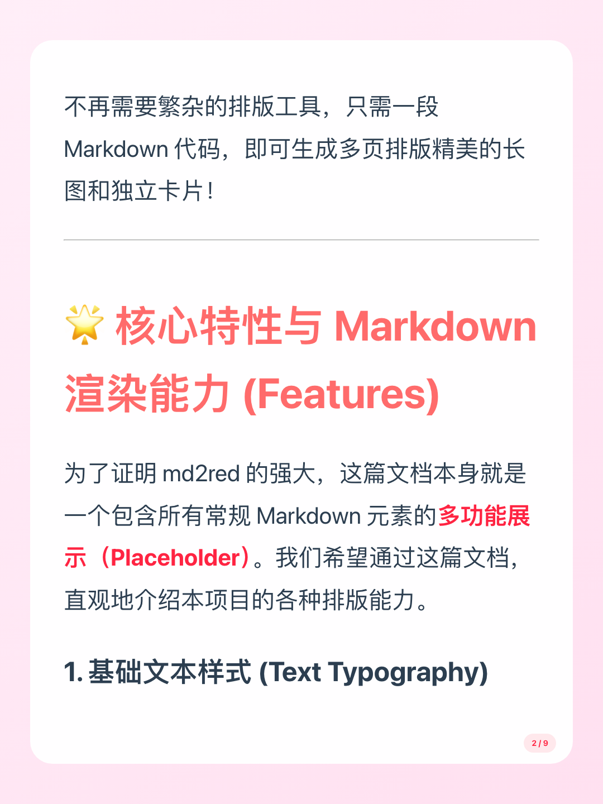
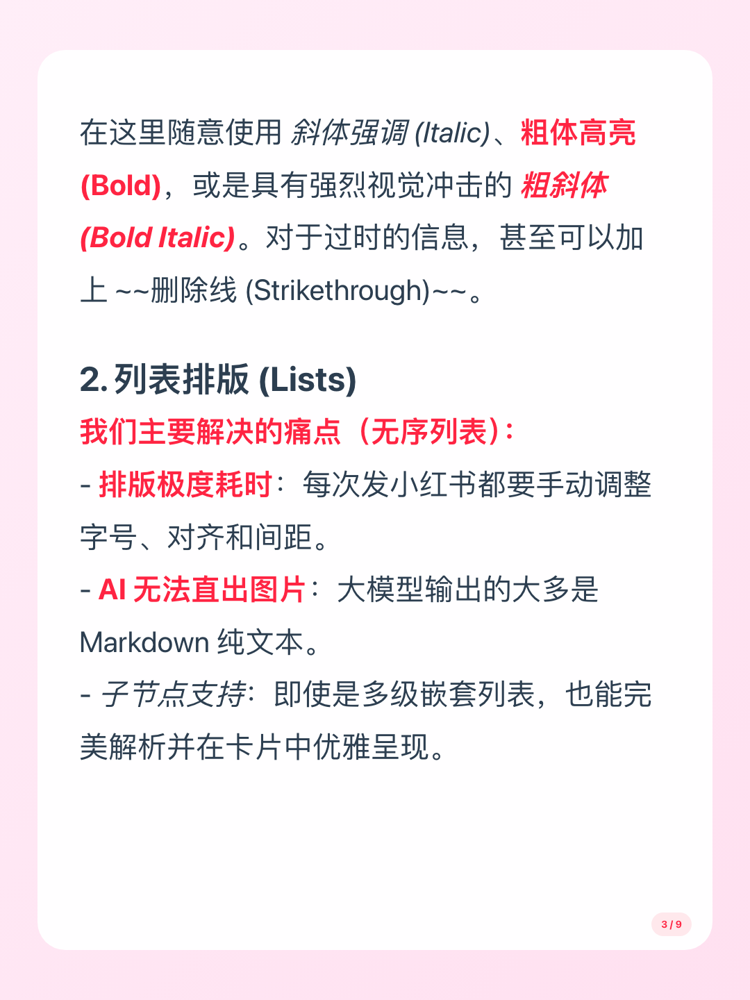
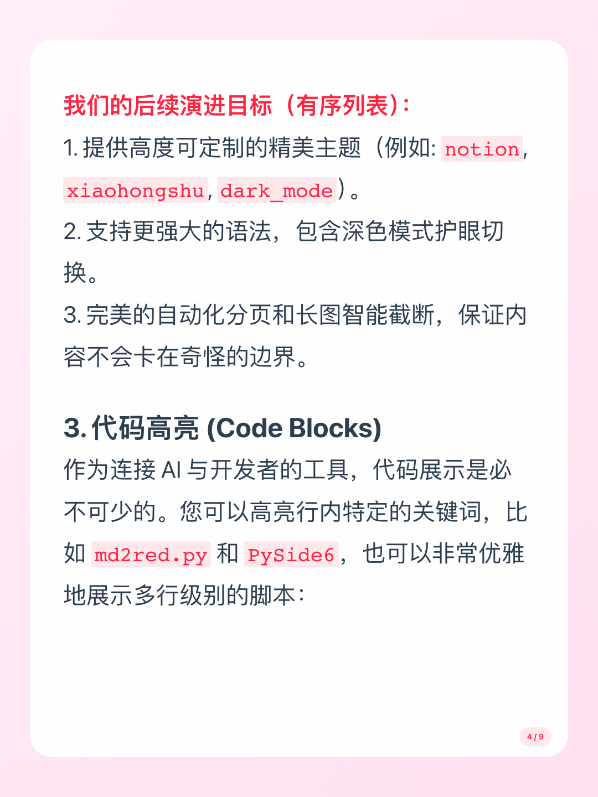
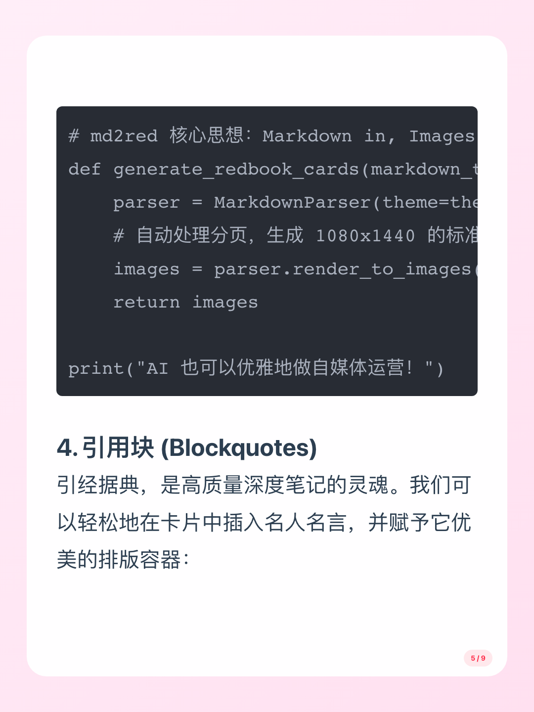
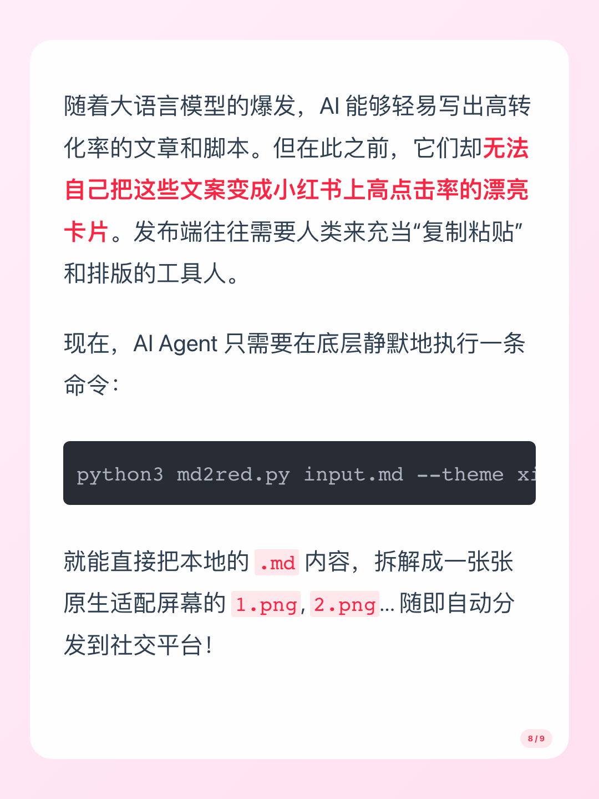
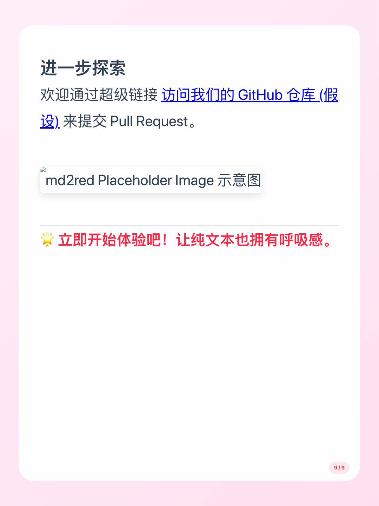

# Markdown to Red (小红书卡片生成器)

将你的 Markdown 文件一键转化为精美的社交媒体（如小红书、抖音、朋友圈、Notion）卡片图片。本项目使用 Python 和 Playwright，支持自动分页、多种主题切换以及自定义尺寸！

## 特点

- 📝 **全面支持 Markdown**：支持标题、段落、粗体、列表、代码块、引用等常用语法。
- 🎨 **丰富的主题模板**：内置多款精美主题（小红书经典、暗黑模式、微信简约、Notion、百万美元等）。
- ✂️ **自动分页**：智能识别内容长度并自动分配到不同的卡片页面。
- 🖥️ **无头浏览器渲染**：利用 Playwright 实现完美的高清像素级渲染。

## 安装说明

1. 克隆本项目到本地：
    ```bash
    git clone https://github.com/your-username/md2red.git
    cd md2red
    ```

2. 安装 Python 依赖：
    ```bash
    pip install -r requirements.txt
    ```

3. 安装 Playwright 所需的 Chromium 浏览器：
    ```bash
    playwright install chromium
    ```

## 使用指南

你可以直接通过命令行执行脚本，传入需要转换的 Markdown 文件。

### 基础用法

最简单的调用方式：
```bash
python md2red.py example.md
```
默认情况下，图片会生成在 `output/<输入文件名>` 文件夹中，默认主题为 `million_dollar`。

### 高级用法

```bash
python md2red.py input.md --theme xiaohongshu --output my_custom_folder --width 1080 --height 1440
```

**参数说明**：
- `input`：必填，你的输入 Markdown 文件路径。
- `--theme`：选填，你想使用的主题。支持可选值：`xiaohongshu`, `dark_mode`, `wechat`, `notion`, `million_dollar`。
- `--output`：选填，生成的图片存放的子目录名（默认：使用输入文件同名路径）。
- `--width`：选填，生成图片的宽度大小（默认：1080）。
- `--height`：选填，生成图片的高度大小（默认：1440）。

## 效果预览 (Example Output)

以下是使用本工具生成的示例成果预览。图片保存在 `example_output` 中：

<div style="display: flex; flex-wrap: wrap; gap: 10px;">
  
  
  
  
  
  
  
  
  
</div>

## 贡献

欢迎提交 Issue 和 Pull Request，我们非常期待您的改进和反馈！

## 开源协议

本项目基于 MIT 协议开源。
